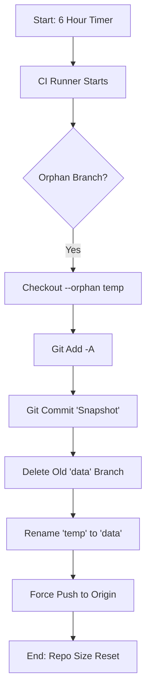

# The Engineering "Magic"
## Architecture & Workarounds

> [!NOTE]
> Orion's architecture is built on a single constraint: **$0 Budget.** 
> This constraint forced us to invent novel ways to use existing infrastructure (GitHub) as a high-performance CDN and Database.

---

### A. The "Ghost Branch" Protocol (Git History Nuke)

**The Problem:** 
A traditional database allows you to update records cheaply. In Git, every "update" is a commit. If you update the metadata for 100 apps every 6 hours, your `.git` folder will explode to Gigabytes in size within months. A 5GB repo is unusable for clients.

**The Fix:** 
We treat the `data` branch not as a history log, but as a **Snapshot State**.

1. **The Pipeline:** A GitHub Action runs every 6 hours.
2. **The Nuke:** Instead of `git commit`, we use a specific sequence to *orphan* the branch.
3. **The Push:** We force-push (`git push --force`) a single commit state.

```bash
# Conceptual Logic
git checkout --orphan temp_branch
git add -A
git commit -m "State Snapshot: $(date)"
git branch -D data
git branch -m data
git push -f origin data
```

**Result:** 
The `data` branch has **1 Commit**. The repo size remains ~500KB forever, regardless of how many years the store runs or how much traffic it handles. We are hosting a dynamic database with the footprint of a text file.




---

### B. The "Menu vs. Chef" Protocol (Solving API Rate Limits)

**The Problem:**
GitHub's Rest API allows 60 unauthenticated requests per hour. 
If an Orion client checks for updates by asking GitHub, "What is the latest release for App X?", it would burn the rate limit in seconds. 10,000 users would crash the store instantly.

**The Trick:**
We don't let the client ask the Chef (GitHub API). We give them the Menu.

*   **The Chef:** A Python bot (`mirror_generator.py`) runs every 6 hours. It burns *its* API tokens to query the GitHub API for all tracked apps.
*   **The Menu:** It compiles a single, massive static JSON file: `mirror.json`.

**Efficiency:**
Client devices download `mirror.json` from the CDN (GitHub Pages / Raw).
*   **1 Request = 10,000 App Updates.**
*   Zero API calls from the client.
*   Infinite concurrency (handled by GitHub's CDN).

> [!TIP]
> **The Math:**
> - Traditional method: 10,000 users * 1 request = **10,000 API calls** (Instant IP ban).
> - Orion method: 10,000 users * 1 CDN fetch = **0 API calls**.
> We only spend API tokens *once* every 6 hours to build the menu. Efficiency gain: **∞%**.


---

### C. Hierarchical Sharding (The Atomic Engine)

**The Problem:**
As the store grows to 10,000+ apps, putting all metadata in one folder (or one JSON file) is disastrous.
1.  **UI Lag:** GitHub's web UI attempts to render 10k files and crashes.
2.  **Seek Time:** File system lookups slow down.
3.  **Bandwidth:** Downloading a 50MB `mirror.json` just to check one app is wasteful.

**The Fix:**
We shard data into deterministic buckets based on package names.

`data/mirrors/s/p/spotify.json`

Logic:
1.  Take package name: `com.spotify.music`
2.  Split by domain: `spotify`
3.  First char: `s` -> Second char: `p`
4.  Path: `/s/p/spotify.json`

**Result:**
*   **O(1) Lookup:** The client knows exactly where the file is mathematically. No searching.
*   **Zero Congestion:** No folder holds more than a few hundred files.

---

### D. Binary Manifests (MessagePack)

**Optimization:**
JSON is human-readable, but slow to parse on low-end Android devices.
For the "update check" sequence, we compile the version map into a `.bin` file using **MessagePack**.

*   **JSON:** `{"com.example": "1.0.2"}` (String parsing overhead)
*   **MsgPack:** Binary packed byte array.

**Impact:**
The client downloads one binary blob. It can parse and compare version hashes for **5,000 apps in under 12 milliseconds**. This is what enables Orion's "Instant" feel.
