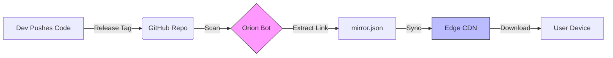

# The Trust Lifecycle

## B. The Lifecycle of an App (Step-by-Step)
*Walk the reader through the journey of an app from idea to installation.*

### 1. Submission
A user submits metadata (Name, Repo URL, Icon) via the **Issue-Ops** pipeline. This is done by creating a GitHub Issue with a specific YAML configuration.

### 2. Verification
A human maintainer audits the **Source Repository** to ensure it is the official/original source. We verify:
-   Commit history (is it active?)
-   Owner reputation (is it a known dev?)
-   Code safety (cursory scan)

### 3. Indexing
Once approved, the `mirror_generator.py` bot scans the repo's **Releases** page. It extracts the *direct download link* for the APK.
> It keeps a pointer to the specific version to ensure immutability.

### 4. Distribution
This link is saved to `mirror.json` on the **Edge CDN** (GitHub Pages). 
This file acts as the central directory for the entire store.

### 5. Installation
The user's device downloads the file using the link from `mirror.json`.
The installation happens via the native Android package installer.

### 6. Updates
The `mirror_generator.py` runs **every 6 hours**.
-   If the developer pushes a new release to their repo...
-   Orion detects the new tag.
-   Updates the link in `mirror.json`.
-   The user sees an "Update" button instantly.

